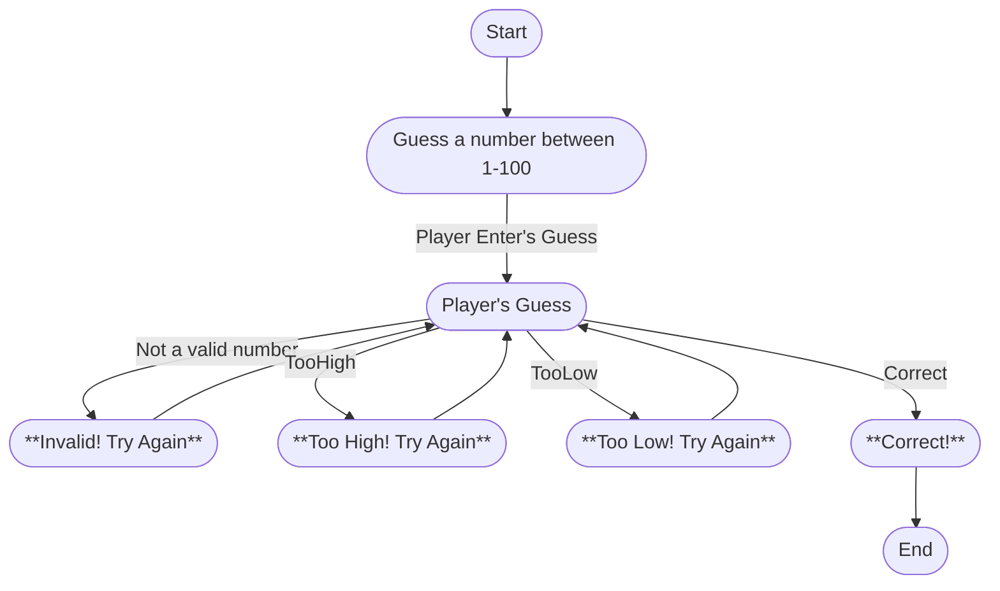

# Guess That Number Game

The game begins with the system generating a random number between 1-100.  
The player must then guess a number between 1-100.  
The game will then give feedback to the player based on the guess.   
If the player puts in a number that is not between 1-100, it will prompt them to try again.  
If guess is wrong, the player must try again until the correct number has been guessed.    
Once the correct number has been guessed, the game will end.
